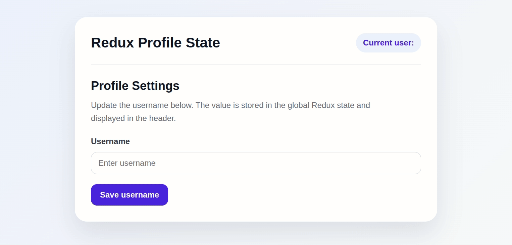

# Redux Toolkit Profile State
## Live Demo
[View Live Site](https://redux-toolkit-profile-state.vercel.app/)

A small React application that demonstrates global state management with Redux Toolkit. The user can update a username in the Profile component, and the updated value is displayed in the Header component through the shared Redux store.

This project was built to practice Redux Toolkit, React Redux hooks, component communication through global state, and clean React project structure.



## Features
- Update a username from a profile form
- Store the username in a global Redux state
- Display the current username in the header
- Share state between separate components
- Responsive card-based layout
- Clean and simple UI for a portfolio project

## Tech Stack
- React
- Vite
- JavaScript
- CSS
- Redux Toolkit
- React Redux

## What I Used
- `configureStore` to create the Redux store in `store.js`
- `createSlice` to create the username slice in `usernameSlice.js`
- `useSelector` to read data from the Redux store
- `useDispatch` to send actions to the Redux store
- `Provider` to make the Redux store available to the React application
- A global `username` state that can be used by multiple components
- A form submit handler to dispatch a new username value

## Why Redux Toolkit Is Used
Redux Toolkit is used to manage global state in a predictable way. Instead of passing data manually from one component to another with props, the application stores shared data in a central Redux store.

In this project, the username is stored globally. The `Profile` component updates the username, and the `Header` component reads the same value from the store. This shows how Redux Toolkit helps different components work with the same state without direct parent-child communication.

Redux Toolkit also simplifies Redux code by providing tools such as `configureStore` and `createSlice`. These tools reduce boilerplate and make it easier to create actions, reducers, and store configuration.

## How It Works
The Redux store is created in `store.js` using `configureStore`.

```js
export const store = configureStore({
  reducer: {
    username: usernameReducer,
  },
});
```
The `usernameSlice.js` file contains the slice logic. It defines the initial state and the `write` reducer, which updates the username value.

```js
const usernameSlice = createSlice({
  name: 'username',
  initialState: '',
  reducers: {
    write(state, action) {
      let username = action.payload.trim();
      username = username.toLowerCase();
      return username;
    },
  },
});
```

The `Profile` component uses `useDispatch` to send the new username to the Redux store.
```js
const dispatch = useDispatch();
dispatch(write(newUsername));
```

The `Header` component uses `useSelector` to read the current username from the global state.
```js
const username = useSelector(state => state.username);
```

## Getting Started
### 1. Clone the repository
```bash
git clone https://github.com/antonina-kachusova/Redux-Toolkit-Profile-State.git
cd redux-toolkit-profile-state
```

### 2. Install dependencies
```bash
npm install
```

### 3. Run the project locally
```bash
npm run dev
```

### 4. Build for production
```bash
npm run build
```

## Scripts
```bash
npm run dev       # Start development server
npm run build     # Build production version
npm run lint      # Run ESLint
npm run preview   # Preview production build locally
```

## Project Structure
```text
redux-profile-state/
├── demo/
│   └── demo.gif
├── src/
│   ├── App.jsx
│   ├── App.css
│   ├── Header.jsx
│   ├── Header.css
│   ├── Profile.jsx
│   ├── store.js
│   ├── usernameSlice.js
│   ├── index.jsx
│   └── index.css
├── index.html
├── package.json
├── package-lock.json
├── vite.config.js
├── eslint.config.js
├── .gitignore
└── README.md
```

## Notes
This is a learning project focused on understanding global state with Redux Toolkit. For a small application like this, local state could also be used, but Redux Toolkit is useful when the same data needs to be shared across multiple components or larger parts of an application.
